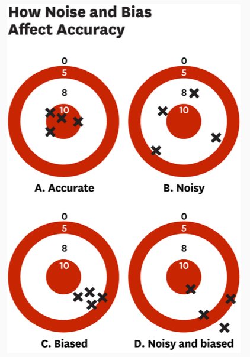

# Revision

## Chapter 1: Causal Inference

- Prediction vs Causation: prediction asks, "what will happen", causation asks, "what are the
  effects of a cause (intervention)"
- Causal questions: counterfactual ("could have been") prediction questions
- Causal effect: difference between outcome if treated ($Y_1$) and outcome if not treated ($Y_0$)
  - Phrasing: difference between actual \<unit> and current \<unit> if more/less \<action>
        was applied
- Potential outcomes framework: causality is tied to an "action" applied to a "unit"
  - "action": treatment/manipulation/intervention
  - "unit": person/firm/country
  - Observe counterfactual by comparing observed outcomes between treated/untreated
- Difference in means: average across treatment and across non-treatment
- Attribute substitution: swap hard questions for easy one
  - "How does \<action> affect \<unit>" to "Do \<unit> with \<action> have \<outcome>"
- Random assignment: manipulating environment to uncover causal relationship
  - Characteristics similar between control and treatment group
  - Verified using balancing test
- Issues with experiments: bias eliminated with random sampling but presence of researchers can
  affect outcome
  - Hawthorne effects: where subjects react to being observed
  - John Henry effects: where subjects react to being in the control group
  - Experiment not internally valid
- Average treatment effect: quantifies impact of treatment for a population
  - Randomized experiment tells us average treatment effect
  - Meaningful only if treatment effect is relatively stable
- Stable Unit Treatment Value Assumption (SUTVA): basic assumption of causal effect stability
  - Potential outcomes of unit i do not depend on the treatments received by other units
  - Violated when
    - Treatment effect differs when more individuals are assigned to it (more individuals should
      not affect the final outcome)
    - Treatment changes the outcomes of the untreated (those who receive treatment affect those
      who don't)
- Natural experiment: real life events resemble randomized experiments
  - Policy interventions (e.g. change in tax rate)
  - Rules and laws (e.g. legal minimum drinking age)
  - Historical episodes (e.g. colonization)
  - Natural events (e.g. rainfall)
  - Contains observable variation in treatment that are random under plausible assumption (quasi)

### Chapter 1 Checklist

1. How to define a causal effect based on the potential outcomes framework?

   The difference between outcome if treated and outcome if not treated.

2. How do experiments with random assignment uncover the causal effect?

   Random assignment ensures that characteristics are similar between the control and treatment
   groups. As a result, any variation in behavior can be attributed to the causal effect.

3. What are the limitations of experiments?

   Hawthorne and John Henry effect, causing the experiment to not be internally valid

4. What is the Stable Unit Treatment Value Assumption and why we need it?

   It is the basic assumption of causal effect stability where it ensures that the potential
   outcome of a unit does not depend on the treatment received by other units

5. What is the essential feature of a natural experiment?

   Should contain observable variation in treatment that are random under plausible assumption.

## Chapter 2: Statistics Basics

- Dummy variables: binary variables
- Continuous variables: includes magnitude
- Scatter plot: visualize causal link between two variables
  - Every dot is an observation
  - More useful for continuous treatment
    - Observes the average values of outcome and how wide spread the values are
- Descriptive evidence: observing the difference in outcome associated with treatment
  - Measured using difference-in-means (care about treatment status) or change in outcome associated with unit of change in treatment (care about treatment intensity)
- Population: complete set of all units of interest to an investigator
  - Population size can be very large
- Sample: observed subset of the population
  - Good sample: representative of population and large enough to be confident about findings
  - Use random selection
  - Large sample size does not guarantee representativeness
- Sample mean: samples from $i=1,\ldots, n$ and each value is $Y_i$

$$\bar{Y} = \frac{1}{n} \sum_{i=1}^{n}Y_{i}$$

- Population (parameter) mean: expectation of variable $Y_i$ ($E[Y_i]$)
  - If $Y_i$ is random, then $E[Y_i]$ is its mean in the population
  - Often unknown, must estimate
- Law of Large Numbers (LLN): with smaller samples, $\bar{Y}$ is never exactly $$E[Y_i]$$ but as sample size gets larger, it approaches the expected value
- Sample statistic/estimator: sample of $\bar{Y}$, approximating population expectation
  - Unbiased if $E[\bar{Y}] = E[Y_i]$ given very large number of samples of any size (average of all samples)
- Sample variance: dispersion of $\bar{Y}$ across repeated samples
  - Best if small, i.e. similar estimates for every sample
  - Depends on variability of data and sample size
  - Very large samples have $\bar{Y}$ as a constant equal to $E[Y_i]$ so 0 sample variance

$$V(\bar{Y})=\frac{\sigma^2_Y}{n}$$

- Standard error: variance of sample mean through standard deviation
  - $\sigma_Y$ is not known so substitute with $$S(Y_i)$$ or the standard deviation of sample

$$SE(\bar{Y}) = \sqrt{V(\bar{Y})} = \frac{\sigma_Y}{\sqrt{n}}$$

- Conditional expectation: expectation outcome of $Y_i$ given condition
- Testing equality of means (t-statistic): consistency between conditional expectations
  - $SE(\bar{Y_1} - \bar{Y_0})$ decreases with sample size
  - t-statistic will (almost) have a standard normal distribution (according to Central Limit Theorem)

$$\frac{\bar{Y_1} - \bar{Y_0}}{SE(\bar{Y_1} - \bar{Y_0})} = \frac{\bar{Y_1} - \bar{Y_0}}{S(Y_i)\sqrt{\frac{1}{n_1} + \frac{1}{n_0}}}$$

- Statistical significance: large t-statistic can reject the null hypothesis (chance to occur is small); p-value < significance
  - Fail to reject null hypothesis != accept null hypothesis (i.e. no evidence in support, but there is evidence to reject)
- Sample size neglect: smaller samples have larger variance
  - Trust the results of larger samples over smaller samples
- Small sample fallacy: small samples demonstrate both outcomes because extreme values skew result
- Sampling bias: some members of a population are systematically more likely to be selected in a sample than others (self-selecting or assigned)
  - Sample is not representative of population
  - E.g. survivorship bias
- Measurement quality: noise is having the points scattered while bias is having points clustered somewhere else
  - Noise cancels out when computing means for outcome but noise in treatment can bias observed relationship between treatment and outcome (i.e. measurement error bias)

### Chapter 2 Checklist

1. How to define the population and what constitutes a good sample for a specific causal question?

   A good population contains all units of interest and a good sample is a large enough subset of the population that is representative of the population and sufficiently large for findings to be generalizable

2. How to construct descriptive evidence for a cause and effect of interest?

   Constructed using difference-in-means or change in outcome per unit time and should be generated from randomized sampling

3. What kind of sample gives sampling bias?

   Samples that are too small or only contain a certain group of the population

4. What is the problem with a small sample?

   Sample size neglect where smaller samples have larger variances and small sample fallacy where a small sample demonstrates both potential outcomes

5. What is the problem with noisy measurements?

   Noise in outcome is negligible in larger sample sizes as they cancel out, however, noise in treatment can cause bias in the observed relationship between treatment and outcome

## Chapter 3: Selection Bias

- Difference-in-means: compute average for all across treated and average for all across untreated and find difference
- Treatment effect differs for treated and untreated
  - Average Treatment Effect on the Treated (ATT)
  - Average Treatment Effect on the Controls/Untreated (ATC/ATNT)
  - Average Treatment Effect is $p \times ATT + (1 - p) \times ATNT$ where $p$ is the proportion of the treated (i.e. difference in means)
    - Average between ATT and ATNT weighted by the proportion treated
- Choosing average treatment effect: depends on policy question of interest
  - Withholding treatment from those who would normally receive it: ATT
  - Expanding treatment to those who don't normally receive it: ATNT
  - Mandating a policy of treatment vs policy of control for everyone: ATE
- Bias: Truth = E[Estimate] - Bias
- Baseline bias: selection based on individual characteristics, resulting in outcome in the absence of treatment being different between treated and untreated
  - Baseline outcome of the treated - untreated (i.e. no treatment)
  - How the observed difference-in-means depart from ATT
  - Selection on the untreated outcome
  - Even without treatment, the group is already going to take a certain action

$$Diff - ATT$$

- Differential Treatment Effect (DTE) bias: treatment effect differs from treated and whole population
  - I.e. expected difference in the treatment effect between the treated and untreated, weighted by the proportion who are untreated
  - How the observed difference-in-means depart from ATE
  - Selection on the magnitude of treatment effect
  - Those that gain more from doing action and take action as a result

$$ATT - ATE = (1 - p)(ATT - ATNT)$$

- All bias: diff - ATE
  - Matters if ATE is target
  - ATT only cares about baseline bias
- Randomization: removes baseline bias and DTE bias so ATT = ATNT = ATE and difference in means = ATT

- Confounders: cause of selection bias; variables that influence both the treatment and outcome
  - When computing the diff-in-means (ATE), the confounding effect does not cancel out so bias exists
  - Causal arrows can be positive/negative
  - Polarity of selection bias dependent on how many positive/negatives

- Mediators: removing can make a difference but not necessary to remove
  - Removing might be counter-productive if caring about total effect
  - Not to control unless testing about alternative mechanisms
- Common effect: removal induces a non-causal association between both variables and it is always counter-productive
  - Never control
- Effect of selection bias on observed correlation: positive overstates positive treatment effects while negative understates positive treatment effect

### Chapter 3 Checklist

1. How to define ATT, ATNT, and ATE based on the potential outcomes framework? What are the two types of selection bias?

   ATT is the average treatment effect on the treated, ATNT is the average treatment effect on the untreated, and ATE is the average between ATT and ATNT weighted by the proportion of treated.

   The two selection biases are baseline bias and differential treatment effect bias.

2. How to compute and interpret those concepts for a hypothetical scenario?

   The best way to do so is by computing the expected values

3. What is a confounder? What is a mediator? What is a common effect?

   A confounder is directly correlated to the both treatment and outcome. A mediator causes the treatment to affect the outcome through the mediator. A common effect is one that both the treatment and outcome directly correlate to.

4. How to infer the direction of selection bias that arise from a confounder?

    See explanation above.

## Chapter 4: Matching and Regression

- Independence assumption: treatment is independent of potential outcome
  - Treatment is unrelated to the outcome in the absence of the treatment and the effect of treatment
  - Cannot be made without random assignment
  - Control all observables (i.e. confounders), cannot control unobservable
  - Outcome of those who are treated (on average) is identical to those who are not treated
- Controlling confounders (Matching): split sample by the confounder and compute the treatment effect within each group and take the weighted average
  - Control it and get rid of selection bias
  - Not exact as missing non-common support
- Conditional Independence Assumption: conditional on characteristics we match on, treatment is independent of potential outcomes
  - Allows estimation of average treatment effect using observational data when all confounders are observed
  - "\<Unit> with the same \<Confounder> have the same potential outcomes, on average, whether or not they \<Action>"
- Treatment assignment mechanism: how are units assigned to treatment and determines likely biases
- Common support: set of values of the support of selection variable where both treated and control units are observed
  - Must be used to compute treatment effect
  - Might only contain small subset of result, thus threatening the generalizability of findings
- Overall ATE: proportion of sample x ATE of group summed with all

- Regression: if Y is related to X, then regression models the relationship of Y and X, i.e $E[Y | X]$
  - Requires: dependent variable, treatment variable, control variables (confounders), parameters, and error term
  - Binary treatment ($D$): $Y_i = \alpha + \beta D_i + e_i$
  - Expect error term to average to 0
  - Continuous treatment: $Y_i = \alpha + \beta X_i + e_i$
  - Estimates difference in means: purpose of $\beta$ substitute this diff in means for that value
  - With more variables (confounders): $Y_i = \alpha^l + \beta^l D_i + \lambda^l C_i + e_i^l$
    - $\beta$ is the relationship between $Y$ and $D$ conditional on $C$
    - Also known as long regression
    - Short regression includes bias
  - Alternative: have a variable per group

- Standard error of simple linear regressions: $Y_i = \alpha + \beta X_i + e_i$

$$SE(\hat{\beta}) = \frac{\sigma_e}{\sqrt{n}} \times \frac{1}{\sigma_X}$$

- Standard error of multivariate linear regressions: $Y_i = \beta_0 + \sum_{k=1}^{K}\beta_k X_{ki} + e_{i}$

$$SE(\hat{\beta_k}) = \frac{\sigma_e}{\sqrt{n}} \times \frac{1}{\sigma_{\tilde{X_k}}}$$

- Effects of adding more control variables
  - Residual variance $\sigma_{e}$ falls because explaining more of variation in $Y_i$
  - $\sigma_{\tilde{X_k}} < \sigma_{X}$ and $\sigma_{\tilde{X_k}}$ falls as explaining more of variation in $X_k$
  - SE can go up or down
  - For a smaller SE, should not control for factors that only affects X, but should control for those that only affect Y

- Bad control: variable that is itself an outcome variable, i.e. might be affected by treatment
  - Might not have any effect on X or Y nor is it an effect of X or Y

### Chapter 4 Checklist

1. If we know the selection process and have data on it, we can use matching or regression to find the causal effects. What is the essence of those methods?

   Matching is used to control the effect of the confounders by separating the observed effects into each group of confounder. Regression aims to do the same but instead by providing a way to model the relationship so that these confounders are accounted for so given $X$, $Y$ can be predicted

2. For a study that applies matching or regression method on observational data in absence of randomization, if the key finding is intended for causal inference, how to spell out the conditional independence assumption?

   \<Unit> with the same \<Confounder> have the same potential outcomes, on average, whether or not they \<Action>

3. How to use a regression model to express your assumptions of how a variable is determined?

   Short regression does not account for the confounders while long regression includes a variable that accounts for the confounder

4. What are the principle considerations for choosing control variables?

   Are the variables confounders, mediators, or common effects? Does it affect only X or only Y?

## Questions to clarify

- For SUTVA, in the case of "How does a longer education affect someone's income?", would valid
  assumptions be like "A person's income is not affected by other people receiving the same length
  of education as themselves" and "The income of a person with longer education should not affect
  the income of someone with less education"
- In chapter 2, blood pressure example, is the new outcome difference 18? That implies that the observed effect is weaker than the actual effect
- When do we know to use ATT, ATNT, ATE
- What is the right answer for (2) of chapter 3 checklist
- For matching example, is the reason why we assume $Y_1$ is the same for all (same as $Y_0$) because we are under independence assumption so the treatment has no effect on potential outcome
- Not too sure how to interpret diagram in Handout 4 slide 67
